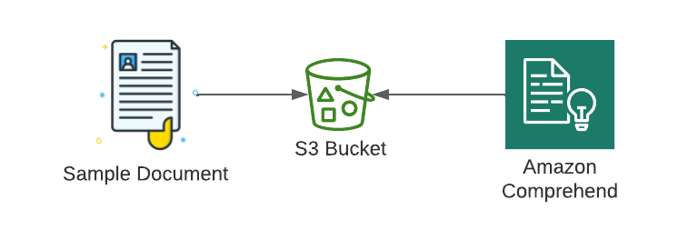

# Redacting PII from text using Amazon Comprehend


## Problem
You have a document with potential personally identifiable information (PII) in it. You would like to remove the PII before more processing of the document occurs.

## Solution
Create sample data and store it in an S3 bucket. Launch an Amazon Comprehend job to detect and redact PII entities. Finally, view the results (see Figure 8-4).



### Prerequisite
* S3 bucket with file for analysis and path for output

## Preparation
### Set a unique suffix to use for the S3 BucketName:
```
RANDOM_STRING=$(aws secretsmanager get-random-password \
--exclude-punctuation --exclude-uppercase \
--password-length 6 --require-each-included-type \
--output text \
--query RandomPassword)
```

### Create a S3 Bucket:

```
aws s3api create-bucket --bucket awscookbook804-$RANDOM_STRING
```

### Create a path for output in your S3 bucket:
```
aws s3api put-object --bucket awscookbook804-$RANDOM_STRING \
--key redacted_output/
```

## Steps
1. Create a file named assume-role-policy.json with the following content (file provided in the repository):
```
{
  "Version": "2012-10-17",
  "Statement": [
  {
    "Effect": "Allow",
    "Principal": {
      "Service": "comprehend.amazonaws.com"
    },
    "Action": "sts:AssumeRole"
  }
  ]
}
```

2. Create a role for the Comprehend job to use to read and write data from S3:
```
aws iam create-role --role-name AWSCookbook804Comprehend \
    --assume-role-policy-document file://assume-role-policy.json
```
You should see output similar to the following:
```
{
  "Role": {
  "Path": "/",
  "RoleName": "AWSCookbook804Comprehend",
  "RoleId": "<<RoldID>>",
  "Arn": "arn:aws:iam::111111111111:role/AWSCookbook804Comprehend",
  "CreateDate": "2021-09-22T13:12:22+00:00",
  "AssumeRolePolicyDocument": {
    "Version": "2012-10-17",
    "Statement": [
      {
...
```

3. Attach the IAM managed policy for `AmazonS3FullAccess` to the IAM role:
```
aws iam attach-role-policy --role-name AWSCookbook804Comprehend \
    --policy-arn arn:aws:iam::aws:policy/AmazonS3FullAccess
```

4. Create some sample PII data using [Faker](https://faker.readthedocs.io/en/master/) (or by hand):
```
pip install faker
faker -r=10 profile > sample_data.txt
```

5. Copy your sample data to the bucket:
```
aws s3 cp ./sample_data.txt s3://awscookbook804-$RANDOM_STRING
```

You should see output similar to the following:
```
upload: ./sample_data.txt to s3://awscookbook804-<<unique>>/sample_data.txt
```

6. Create a start-pii-entities-detection-job with Comprehend:
```
JOB_ID=$(aws comprehend start-pii-entities-detection-job \
    --input-data-config S3Uri="s3://awscookbook804-$RANDOM_STRING/sample_data.txt" \
    --output-data-config S3Uri="s3://awscookbook804-$RANDOM_STRING/redacted_output/" \
    --mode "ONLY_REDACTION" \
    --redaction-config PiiEntityTypes="BANK_ACCOUNT_NUMBER","BANK_ROUTING","CREDIT_DEBIT_NUMBER","CREDIT_DEBIT_CVV","CREDIT_DEBIT_EXPIRY","PIN","EMAIL","ADDRESS","NAME","PHONE","SSN",MaskMode="REPLACE_WITH_PII_ENTITY_TYPE" \
    --data-access-role-arn "arn:aws:iam::${AWS_ACCOUNT_ID}:role/AWSCookbook804Comprehend" \
    --job-name "aws cookbook 804" \
    --language-code "en" \
    --output text --query JobId)
```

> TIP: You can alternatively use the [detect-pii-entities](https://awscli.amazonaws.com/v2/documentation/api/latest/reference/comprehend/detect-pii-entities.html) command if you are interested in the location of PII data in a document. This is helpful if you need to process the PII in a certain way.

7. Monitor the job until it is COMPLETED; this will take a few minutes:
```
aws comprehend describe-pii-entities-detection-job \
    --job-id $JOB_ID
```

You should see output similar to the following:
```
{
  "PiiEntitiesDetectionJobProperties": {
  "JobId": "<<hash>>",
  "JobName": "aws cookbook 804",
  "JobStatus": "COMPLETED",
  "SubmitTime": "2021-06-29T18:35:14.701000-04:00",
  "EndTime": "2021-06-29T18:43:21.200000-04:00",
  "InputDataConfig": {
    "S3Uri": "s3://awscookbook804-<<string>>/sample_data.txt",
    "InputFormat": "ONE_DOC_PER_LINE"
  },
  "OutputDataConfig": {
    "S3Uri": "s3://awscookbook804-<<string>>/redacted_output/<<Account Id>>-PII-<<hash>>/output/"
  },
```

## Validation checks
When the job is complete, get the location of the outputted data in S3:
```
S3_LOCATION=$(aws comprehend describe-pii-entities-detection-job \
    --job-id $JOB_ID --output text \
    --query PiiEntitiesDetectionJobProperties.OutputDataConfig.S3Uri)
```

Get the output file from S3:
```
aws s3 cp ${S3_LOCATION}sample_data.txt.out .
```

You should see output similar to the following:
```
download: s3://awscookbook804-<<unique>>/redacted_output/111111111111-PII-cb5991dd58105db185a4cc1906e38411/output/sample_data.txt.out to ./sample_data.txt.out
```

View the output:
```
cat sample_data.txt.out
```

You should see output similar to the following. Notice the PII has been redacted:
```
{'job': 'Arts development officer', 'company': 'Vance Group', 'ssn': '[SSN]', 'residence':
'[ADDRESS]\[ADDRESS]', 'current_location': (Decimal('77.6093685'), Decimal('-90.497660')), 'blood_group':
'O-', 'website': ['http://cook.com/', 'http://washington.biz/', 'http://owens.net/',
'http://www.benson.com/'], 'username': 'rrobinson', 'name': '[NAME]', 'sex': 'M', 'address':
'[ADDRESS]\[ADDRESS]', 'mail': '[EMAIL]', 'birthdate': datetime.date(1989, 10, 27)}
```

## Clean up 
### Detach the AmazonS3FullAccess policy from the role:
```
aws iam detach-role-policy --role-name AWSCookbook804Comprehend \
--policy-arn arn:aws:iam::aws:policy/AmazonS3FullAccess
```

### Delete the IAM Role:

```
aws iam delete-role --role-name AWSCookbook804Comprehend
```

### Delete the objects in your S3 bucket:
```
aws s3 rm s3://awscookbook804-$RANDOM_STRING/sample_data.txt
aws s3 rm s3://awscookbook804-$RANDOM_STRING/redacted_output/.write_access_check_file.temp
aws s3 rm ${S3_LOCATION}sample_data.txt.out
aws s3 rm ${S3_LOCATION}
aws s3 rm s3://awscookbook804-$RANDOM_STRING/redacted_output/
```

### Delete the S3 bucket:

```
aws s3api delete-bucket --bucket awscookbook804-$RANDOM_STRING
```

### Unset the environment variable that you created manually:
```
unset RANDOM_STRING
unset JOB_ID
unset S3_LOCATION
```

## Discussion
PII is closely associated with many security and compliance standards that you may come across in your career responsibilities. Generally, if you are responsible for handling PII for your customers, you need to implement security mechanisms to ensure the safety of that data. Furthermore, you may need to detect and analyze the kind of PII you store. While [Amazon Macie](https://aws.amazon.com/macie/) can do this at scale within your S3 buckets or data lake, you may want to detect PII within your application to implement your own checks and workflows. For example, you may have a user fill out a form and submit it, and then detect if they have accidentally disclosed specific types of PII that you are not allowed to store, and reject the upload.

You can leverage Amazon Comprehend to detect this type of information for you. When you use Comprehend, the predefined feature detection is backed by detection models that are trained using large datasets to ensure quality results.

### Challenge
Use Comprehend to label the type of PII rather than just redacting it. (This [documentation](https://awscli.amazonaws.com/v2/documentation/api/latest/reference/comprehend/contains-pii-entities.html) provides a hint.)
